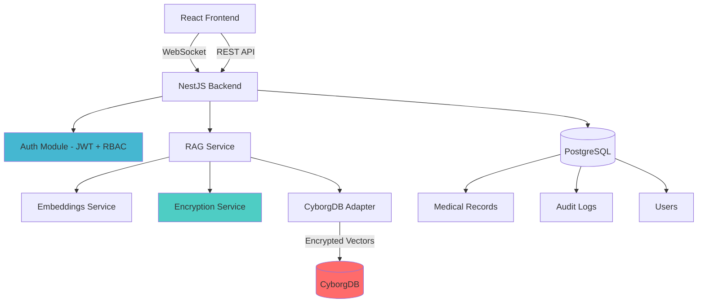

# Encrypted Medical RAG AI

A HIPAA-compliant medical chatbot using **CyborgDB encrypted vector search** for secure RAG pipelines where medical record embeddings are encrypted end-to-end.


## 🎯 Project Overview

This application demonstrates **encryption-in-use** for AI/ML workloads, preventing vector inversion attacks by keeping embeddings encrypted throughout storage and retrieval. Medical professionals can interact with patient data through a secure chatbot without exposing sensitive vector representations.

### Key Features

- 🔐 **End-to-End Encryption**: Medical embeddings encrypted with AES-256-GCM before storage
- 🏥 **HIPAA Compliance**: Full audit logging and role-based access control
- 🤖 **RAG Pipeline**: Retrieval-Augmented Generation with encrypted similarity search
- ⚡ **Real-time Chat**: WebSocket-based streaming responses
- 📊 **Performance Metrics**: Built-in benchmarking for query latency and throughput
- 🐳 **Docker Ready**: Complete containerization with docker-compose

## 🏗️ Architecture



### Tech Stack

**Backend:**
- NestJS (TypeScript)
- PostgreSQL with TypeORM
- CyborgDB (Encrypted Vector Search)
- JWT Authentication
- WebSocket (Socket.io)

**Frontend:**
- React 18
- TypeScript
- Vite
- TailwindCSS
- Socket.io-client

**Embedding Models:**
- OpenAI Embeddings API (configurable)
- Ollama (local deployment option)

## 🚀 Quick Start

### Prerequisites

- Node.js 18+ and npm
- Docker and Docker Compose
- PostgreSQL 14+ (if running without Docker)
- CyborgDB instance or credentials

### Environment Configuration

Create `.env` files in both `backend` and `frontend` directories:

**Backend** (`backend/.env`):
```env
# Copy from backend/.env.example and fill in values
NODE_ENV=development
PORT=3000

# Database
DATABASE_HOST=localhost
DATABASE_PORT=5432
DATABASE_USER=postgres
DATABASE_PASSWORD=your_password
DATABASE_NAME=encrypted_medical_rag

# CyborgDB
CYBORGDB_API_URL=https://api.cyborgdb.com
CYBORGDB_API_KEY=your_cyborgdb_api_key
CYBORGDB_INDEX_NAME=medical-embeddings

# Encryption
ENCRYPTION_KEY=your-256-bit-hex-key-here
ENCRYPTION_ALGORITHM=aes-256-gcm

# JWT
JWT_SECRET=your-jwt-secret-key
JWT_EXPIRATION=24h

# Embeddings (OpenAI or Ollama)
EMBEDDING_PROVIDER=openai
OPENAI_API_KEY=your_openai_api_key
# OR for Ollama:
# EMBEDDING_PROVIDER=ollama
# OLLAMA_BASE_URL=http://localhost:11434
```

**Frontend** (`frontend/.env`):
```env
VITE_API_BASE_URL=http://localhost:3000
VITE_WS_URL=ws://localhost:3000
```

### Running with Docker (Recommended)

```bash
# Start all services
docker-compose -f docker/docker-compose.yml up --build

# Frontend: http://localhost:5173
# Backend API: http://localhost:3000
# API Docs: http://localhost:3000/api
```

### Running Locally

**Backend:**
```bash
cd backend
npm install
npm run start:dev
```

**Frontend:**
```bash
cd frontend
npm install
npm run dev
```

## 📖 Usage

### 1. Register/Login

Navigate to `http://localhost:5173` and create an account. Default roles:
- `user`: Can view and query medical records
- `doctor`: Can create and manage medical records
- `admin`: Full access + audit log viewing

### 2. Upload Medical Records

Use the API or UI to upload medical documents. The system will:
1. Chunk the document
2. Generate embeddings using OpenAI/Ollama
3. Encrypt embeddings with AES-256-GCM
4. Store encrypted vectors in CyborgDB
5. Store metadata in PostgreSQL

```bash
# Example API call
curl -X POST http://localhost:3000/api/medical-records \
  -H "Authorization: Bearer YOUR_JWT_TOKEN" \
  -H "Content-Type: application/json" \
  -d '{
    "patientId": "P001",
    "content": "Patient presents with...",
    "recordType": "clinical_note"
  }'
```

### 3. Chat with Encrypted Data

Open the chat interface and ask medical questions:
- "What are the symptoms for patient P001?"
- "Show me the latest lab results"

The RAG pipeline will:
1. Generate embedding for your query
2. Search encrypted vectors in CyborgDB
3. Decrypt results **in-memory only**
4. Assemble context
5. Stream LLM response

## 🧪 Testing & Performance

### Run Unit Tests

```bash
cd backend
npm test
```

### Run Integration Tests

```bash
cd backend
npm run test:e2e
```

### Performance Benchmarking

```bash
cd scripts/performance-tests
npm install
npm run benchmark
```

This will generate a performance report with:
- Query latency (p50, p95, p99)
- Throughput (queries/second)
- Memory usage
- Encryption/decryption overhead

**Expected Performance:**
- Query latency: <100ms (p95)
- Throughput: >100 queries/second
- Encryption overhead: <10ms per operation

## 🔒 Security & Compliance

### HIPAA Compliance Features

✅ **Encryption at Rest**: All embeddings encrypted before storage  
✅ **Encryption in Transit**: HTTPS/WSS for all communications  
✅ **Access Control**: Role-based access with permission checks  
✅ **Audit Logging**: Complete audit trail for all data access  
✅ **Authentication**: JWT-based auth with secure password hashing  
✅ **Data Minimization**: Only necessary data in memory

### Encryption Workflow

```
Medical Record → Chunking → Embedding Generation
                                  ↓
                          AES-256-GCM Encryption
                                  ↓
                          CyborgDB Storage
                                  ↓
                      (encrypted at rest)
                                  ↓
         Query → Similarity Search (encrypted)
                                  ↓
                  Decrypt in-memory ONLY
                                  ↓
                    Context Assembly → LLM
```

## 📊 API Documentation

Once running, visit http://localhost:3000/api for interactive Swagger documentation.

### Key Endpoints

- `POST /api/auth/register` - Register new user
- `POST /api/auth/login` - Login and get JWT
- `GET /api/medical-records` - List medical records
- `POST /api/medical-records` - Create medical record
- `POST /api/chat/message` - Send chat message
- `GET /api/logs/audit` - View audit logs (admin only)

## 🛠️ Development

### Project Structure

```
encrypted-medical-rag-ai/
├── backend/
│   ├── src/
│   │   ├── modules/
│   │   │   ├── auth/          # JWT authentication & RBAC
│   │   │   ├── cyborgdb/      # CyborgDB integration
│   │   │   ├── encryption/    # AES-256-GCM encryption
│   │   │   ├── embeddings/    # OpenAI/Ollama integration
│   │   │   ├── medical-records/
│   │   │   ├── rag/           # RAG pipeline
│   │   │   ├── chat/          # WebSocket chat
│   │   │   └── logs/          # Audit logging
│   │   ├── config/
│   │   ├── app.module.ts
│   │   └── main.ts
│   ├── test/
│   └── package.json
├── frontend/
│   ├── src/
│   │   ├── components/
│   │   ├── pages/
│   │   ├── services/
│   │   └── main.tsx
│   └── package.json
├── scripts/
│   └── performance-tests/
├── docker/
│   └── docker-compose.yml
└── README.md
```

### Adding New Features

1. Create a new module in `backend/src/modules/`
2. Register in `app.module.ts`
3. Add corresponding frontend components in `frontend/src/`
4. Update tests and documentation

## ⚠️ Known Limitations

1. **CyborgDB Integration**: This implementation uses an adapter pattern. You'll need to integrate the actual CyborgDB SDK based on their documentation.

2. **Embedding Models**: The application supports OpenAI and Ollama. For production, consider:
   - Rate limiting for API calls
   - Caching frequently used embeddings
   - Batch processing for large datasets

3. **Scalability**: Current implementation is single-instance. For production:
   - Use Redis for session management
   - Implement horizontal scaling with load balancer
   - Consider message queue for async processing

4. **Vector Inversion Protection**: While encryption prevents direct vector inversion, consider:
   - Rate limiting queries to prevent inference attacks
   - Monitoring for suspicious access patterns
   - Regular key rotation

## 📈 Performance Evaluation

Run the benchmarking suite to evaluate:

```bash
cd scripts/performance-tests
npm run benchmark -- --dataset-size 10000 --concurrent-queries 100
```

Results will be saved to `performance-report.json` with metrics:
- Average query latency
- Throughput (QPS)
- Encryption/decryption time
- Memory usage
- p50, p95, p99 latency percentiles

## 🤝 Contributing

This is a demonstration project. For production use:
1. Complete CyborgDB integration with official SDK
2. Implement comprehensive error handling
3. Add monitoring and alerting
4. Conduct security audit
5. Implement key rotation strategy
6. Add data backup and recovery

## 📄 License

MIT License - see LICENSE file for details

## 🆘 Support

For issues or questions:
1. Check the documentation
2. Review audit logs for errors
3. Run diagnostic scripts in `scripts/`
4. Open an issue on GitHub

---

**Built with ❤️ for secure AI applications**

*Preventing vector inversion attacks through encryption-in-use*
